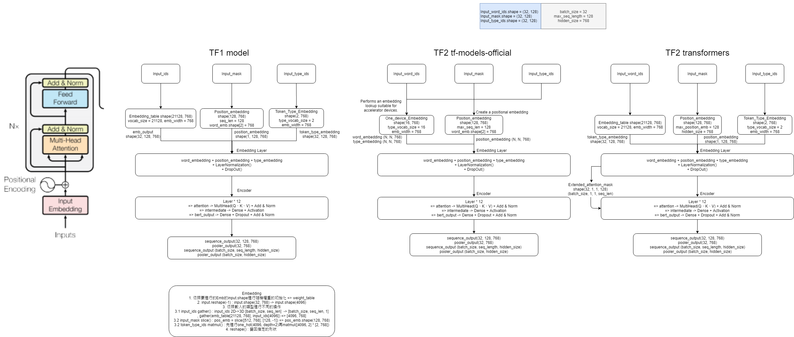

# OpView情緒訓練工具
本專案為針對OpView資料內容，進行情緒分析(Fine-Tuning BERT)，並提供shell script輔助訓練。

## outline
- [目的](#目的)
- [需求](#需求)
- [Requirements](#requirements)
- [情緒對照表](#情緒對照表)
- [輸入資料範例](#輸入資料範例)
- [輸出資料格式](#輸出資料格式)
- [Quick start](#quick-start)
- [功能說明](#功能說明)
- [實驗紀錄](#實驗紀錄)
- [參考資料](#參考資料)
- [QA](#QA)

## 目的
- 減少訓練模型的難度，以及更新原有的框架(TensorFlow 1 -> 2)

## 需求
1. 訓練工具需求
    - 輸入資料集(訓練集、測試集)，輸出訓練好的BERT模型(savedModel格式)
2. 模型需求
    - 輸入文章字串，輸出機率分數和預測分類

## Requirements
- ubuntu == 18.04
- python >= 3.6.9
- [nvidia-docker](https://docs.nvidia.com/datacenter/cloud-native/container-toolkit/install-guide.html#installing-on-ubuntu-and-debian)
    <details>
    <summary>安裝步驟</summary>
    
    ```
    sudo apt-get install -y nvidia-docker2
    sudo systemctl restart docker
    sudo docker run --rm --gpus all nvidia/cuda:11.0-base nvidia-smi
    ```
    </details>
- Nvidia 顯卡驅動(nvidia-smi)
    <details>
    <summary>安裝步驟</summary>

    ```
    安裝步驟
    1. sudo apt install ubuntu-drivers-common
    2. ubuntu-drivers devices - 查看顯卡型號和推薦安裝驅動版本號，並選擇想安裝的版本
    2. sudo apt install nvidia-driver-455 - 安裝驅動
    3. 重新啟動 (sudo reboot)
    4. nvidia-smi - 檢查GPU狀態
    ```
    </details>

## 情緒對照表
```json
{
  "0": "正面",
  "1": "負面",
  "2": "中立"
}
```

## 輸入資料範例
- 檔案目錄 : datasets/sentiment/
- 訓練資料`train.tsv`與驗證資料`test.tsv`皆為`tsv格式`，並且以`\t`作為分隔。

text|label|
----|-----|
噓:皇民是日本人的意思喔，罵窩們皇民是在稱讚吧|1
推:顏色好美！|0
推:一銀那麼好借怎麼都不借我|2

## 輸出資料格式
- 即各個文章字串的機率分數，抓最大值來代表情緒
- e.g : [0.00403965 0.98463815 0.01132222]，最大值為**0.98463815**，index=**1**，對應到對照表，即代表**負面**情緒
```
[[0.00403965 0.98463815 0.01132222],
 [0.9897307  0.00142236 0.00884701],
 [0.00303223 0.9747216  0.02224614],
 ...
 [0.09621345 0.46099612 0.4427904 ]
 [0.0937982  0.21287207 0.6933297 ]
 [0.23805933 0.00547114 0.75646955]]
```

## Quick start
- 確認資料集(dataset/sentiment/)是否存在，且包含train.tsv、test.tsv

### 建立images
- 利用docker file建立images，並掛載當前目錄到images內
```bash
make build_images
```

### 訓練模型
- 透過建立好的docker image進行run的操作。可以指派要使用的GPU數量和`train_sentiment_v2.sh`
```bash
make run_fine_tuning_sentiment
```

### 驗證模型
- 透過建立好的docker image進行run的操作。可以指派要使用的GPU數量和`eval_sentiment_v2.sh`
```bash
make run_eval_sentiment
```

### demo模型
- 透過建立好的docker image進行run的操作。可以指派要使用的GPU數量和`demo_sentiment_v2.sh`
```bash
make run_demo_sentiment
```

## 功能說明
- [情緒模型](#情緒模型)
    - [訓練模型](#訓練模型)
    - [驗證模型](#驗證模型)
    - [展示模型](#展示模型)

### 情緒模型
```
python core/run_sentiment.py --help
```

<details>
<summary>args</summary>

```
    -h, --help            show this help message and exit
    --batch_size: Total batch size for training.
                (default: '32') (an integer)
    --data_dir: The input data dir. Should contain the .tsv files
                (or other data files) for the task.
    --[no]do_demo: Whether to run the model in inference mode on the test set.
                (default: 'false')
    --[no]do_eval: Whether to run eval on the dev set.
                (default: 'false')
    --[no]do_train: Whether to run training.
                (default: 'false')
    --eval_batch_num: set input predict batch number, default is -1 mean predict
                all data
                (default: '-1')
                (an integer)
    --learning_rate: The initial learning rate for Adam.
                (default: '5e-05')
                (a number)
    --max_seq_length: The maximum total input sequence length after WordPiece
                tokenization. Sequences longer than this will be truncated, and sequences
                shorter than this will be padded.
                (default: '128')
                (an integer)
    --model_name: Please input 'bert-base-chinese'、'ckiplab/bert-base-chinese'、'ckiplab/albert-base-chinese'、
                'ckiplab/albert-tiny-chinese',to set pretrained model name.
                (default: 'bert-base-chinese')
    --num_epochs: Total number of training epochs to perform.
                (default: '3')
                (an integer)
    --output_dir: The output directory where the model checkpoints will be written.
    --task_name: The name of the task to train.
    --warmup_proportion: Proportion of training to perform linear learning rate
                warmup for. E.g., 0.1 = 10% of training.
                (default: '0.1')
                (a number)
```
</details>

#### 訓練模型
- 讀取**data_dir**參數下的檔案(train.tsv、test.tsv)，切割訓練集筆數的0.05%當作validation dataset，再進行Fine-Tuning BERT多類別任務，最後儲存[模型報告](#模型報告)
- shell args 必帶參數
```
DATA_DIR=./datasets/sentiment
MODEL_NAME="bert-base-chinese"
--task_name=sentiment \
--do_train=True \
--do_eval=False \
--do_demo=False \
--data_dir=$DATA_DIR \
--num_epochs=2 \
--model_name=$MODEL_NAME \
--output_dir=checkpoints/sentiment/2
```
- 目前測試過的模型checkpoint(ckiplab: 中研院)，
    - bert-base-chinese
    - ckiplab/bert-base-chinese
    - ckiplab/albert-base-chinese
    - ckiplab/albert-tiny-chinese
- 客製化模型Input、Output藉此來符合舊規格
<details>
<summary>Code example</summary>

```python
import tensorflow as tf
from transformers import TFAutoModel
from absl import flags

FLAGS = flags.FLAGS

def create_model(self):
    """Build BERT model. Custom Input Layer(input_ids、input_mask、segment_ids) and Output Layer(Dropout、Dense)"""
    input_word_ids = tf.keras.layers.Input(shape=(None,), dtype=tf.int32,
                                           name="input_ids")
    input_mask = tf.keras.layers.Input(shape=(None,), dtype=tf.int32,
                                       name="input_mask")
    segment_ids = tf.keras.layers.Input(shape=(None,), dtype=tf.int32,
                                        name="segment_ids")
    # because ckiplab/models is use Pytorch develop so need to add 'from_pt' args
    model = TFAutoModel.from_pretrained(
        pretrained_model_name_or_path=self.model_name,
        from_pt=True if "ckiplab/" in self.model_name else False,
        num_labels=len(self.label_list)
    )
    model._saved_model_inputs_spec = None
    sequence_output = model([input_word_ids, input_mask, segment_ids])
    out = tf.keras.layers.Dropout(FLAGS.warmup_proportion)(sequence_output.pooler_output)
    out = tf.keras.layers.Dense(
        units=len(self.label_list),
        activation="softmax",
        name="probabilities"
    )(out)

    model = tf.keras.models.Model(
        inputs=[input_word_ids, input_mask, segment_ids],
        outputs=out,
        name=self.task_name)

    model.summary()

    return model
```
</details>

##### 模型報告
- 訓練完模型後，儲存的模型歷史紀錄，以及驗證資料的confusion matrix，用來觀看模型好壞
<details>
<summary>summary 範例</summary>

```
        - epoch:         [0, 1]
        - params:        {'verbose': 1, 'epochs': 2, 'steps': 417}
        - loss:          [0.40817883610725403, 0.21885691583156586]
        - accuracy:      [0.8476840853691101, 0.9230538010597229]
        - val_loss:      [0.2668299973011017, 0.2991047501564026]
        - val_accuracy:  [0.9088318943977356, 0.9017093777656555]
        - report:      
              precision    recall  f1-score   support

           0     0.9366    0.9131    0.9247      1036
           1     0.8828    0.9300    0.9058      1328
           2     0.8687    0.8345    0.8513      1142

    accuracy                         0.8939      3506
   macro avg     0.8960    0.8925    0.8939      3506
weighted avg     0.8941    0.8939    0.8936      3506

        - total_time:    621.076s
```
</details> 

#### 驗證模型
- 透過**output_dir**參數來指定模型位置，並進行**keras.load_model**的動作，再讀取**data_dir**裡的test.tsv進行驗證，最後撰寫[驗證報告](#驗證報告)儲存在**output_dir**內
- shell args 必帶參數
```
DATA_DIR=./datasets/sentiment
--task_name=sentiment \
--do_train=False \
--do_eval=True \
--do_demo=False \
--data_dir=$DATA_DIR \
--output_dir=checkpoints/sentiment/2
```

- python example
```python
import tensorflow as tf

output_dir = "checkpoints/sentiment/2/"
model = tf.keras.models.load_model(output_dir)
model.summary()
```
##### 驗證報告
- eval_report.txt:儲存驗證資料的confusion matrix
```
        - report:      
              precision    recall  f1-score   support

           0     1.0000    1.0000    1.0000        10
           1     0.9167    0.9167    0.9167        12
           2     0.9000    0.9000    0.9000        10

    accuracy                         0.9375        32
   macro avg     0.9389    0.9389    0.9389        32
weighted avg     0.9375    0.9375    0.9375        32

        - total_time:    217.657s
```

- test_result.tsv:儲存驗證資料的實際label和預測label比較圖
```
text,true,pred
噓:皇民是日本人的意思喔，罵窩們皇民是在稱讚吧,1,1
推:顏色好美！,0,0
...
過敏所以暫不考慮這間~~,1,1
推:一銀那麼好借怎麼都不借我,2,2
```

#### 展示模型
- 透過**output_dir**參數來指定模型位置，並進行**keras.load_model**的動作，再等待使用者輸入文章字串，最後輸出各種分類的分數，以及預測結果
- 可藉由console進行模型預測展示
- shell args 必帶參數
```
--task_name=sentiment \
--do_train=False \
--do_eval=False \
--do_demo=True \
--output_dir=checkpoints/sentiment/2
```
- 使用範例
```
--> [input content]: 這家店超棒的
positive:0.9112719297409058, negative:0.027610205113887787, neutral:0.061117853969335556
predict result : positive

--> [input content]: 這家店超爛的
positive:0.27210354804992676, negative:0.6493704915046692, neutral:0.07852598279714584
predict result : negative

--> [input content]: 這家店普通
positive:0.3982468247413635, negative:0.13436941802501678, neutral:0.4673837423324585
predict result : neutral
```

## 實驗紀錄

### 比較learning_rate對各模型的影響
- max_seq_length=128
- batch_size=32
- num_train_epochs=2
- predict_data=test.tsv(3506筆)
- train_data=train.tsv(14023筆)

- `bert-base-chinese` best test_acc: 0.9062
- `ckiplab/bert-base-chinese` est test_acc: 0.9016

| | lr |train_loss|train_acc|val_loss|val_acc|test_loss|test_acc|train_times|predict_times|
|---|---|---|---|---|---|---|---|---|---|
|bert-base-chinese(no train)|2e-5|1.4478|0.3872|1.4788|0.3782|1.4278|0.3889|207.03s|23.506s|
|bert-base-chinese(no val dataset)|2e-5|0.2531|0.9084| | |0.3169|0.9022|654.327s|23.53s|
|`bert-base-chinese`|2e-5|0.2491|0.9133|0.2656|0.9217|0.2989|0.9062|635.389s|22.797s|
|bert-base-chinese|5e-5|0.2360|0.9183|0.3150|0.8875|0.3095|0.8925|635.733s|22.816s|
|ckiplab/bert-base-chinese|2e-5|0.2517|0.9125|0.2811|0.9031|0.3176|0.8959|636.942s|22.86s|
|ckiplab/bert-base-chinese|5e-5|0.2664|0.9072|0.3025|0.9074|0.3568|0.8756|634.246s|22.808s|
|ckiplab/albert-base-chinese|2e-5|0.4138|0.8462|0.4197|0.8632|0.4093|0.8577|523.806s|19.81s|
|ckiplab/albert-base-chinese|5e-5|0.4277|0.8524|0.4144|0.8618|0.4012|0.8574|520.125s|19.839s|
|ckiplab/albert-tiny-chinese|2e-5|0.4922|0.8111|0.4460|0.8376|0.4463|0.8360|104.799s|3.375s|
|ckiplab/albert-tiny-chinese|5e-5|0.4301|0.8343|0.4130|0.8476|0.4326|0.8363|104.413s|3.363s|

### 比較各模型的架構
- TF1 model structure、TF2 tf-models-official model structure、TF2 transformers model structure


## 參考資料
- https://www.tensorflow.org/official_models/fine_tuning_bert
- https://huggingface.co/transformers/master/model_doc/bert.html#tfbertforsequenceclassification
- https://github.com/ckiplab/ckip-transformers
- https://leemeng.tw/attack_on_bert_transfer_learning_in_nlp.html
- https://arxiv.org/pdf/1706.03762.pdf

## QA
1. How to save the whole model as SavedModel format for inference?
    - [answer](https://github.com/huggingface/transformers/issues/6864#issuecomment-690086932)


# 代辦事項
- 測試分佈式訓練架構(可行性、正確率、time)
- [x] 有無驗證集的albert-tiny訓練(正確率、time)
- 2020情緒模型meeting準備(AS1需求有哪些 該怎麼改進、情緒標籤定義、訓練資料準備) -> 目標正確率90%以上
    - 需求有哪些
        - [新版情緒判讀回饋收集_2019](https://docs.google.com/spreadsheets/d/1yJQZewog_okG_VpvQelW0vImwcCUc_oUoUDdqNTCrY8/edit#gid=0)
        - [短文判斷誤差](https://docs.google.com/spreadsheets/d/10-cXs3QXnLw3srPHorewPQ-5ZQZEDoG9/edit#gid=1025761945)
            - #好想去旅行 --> P
            - #歡迎光臨 --> P
            - 郭春風 --> N
            - 股票又漲了。 --> N
        - 怎麼改進
            - 新模型
            - 後處理
    - 情緒標籤定義(一段字串所對應到發文者的情緒)
        - 正面 : 指該文章表面出積極、快感、開心、樂觀、自信、信任、感恩等可以引發良好事情的情緒
            - 開心 : 螢幕真的大的很過癮！
            - 感恩 : 好的，謝謝大家
            - 引發良好事情 : 推:太厲害了！必須推
        - 負面 : 指該文章表面出焦慮、緊張、憤怒、沮喪、悲痛、痛苦、反諷、嘲諷等會造成不好事情的情緒
            - 憤怒 : 噓:垃圾黨不意外
            - 反諷 : 推:昨天已跳遠傳中華吃屎
            - 造成不好事情 : 對surface有陰影，不敢買微軟了
        - 中立 : 指該文章表達不是正面、負面的情緒或沒有意義，包含姓名、專有名詞、特定產業(Dcard刪文、Hyundai Taiwan客戶小編...)
            - 不是正面、負面的情緒 : 所以他可以打gta5嗎？
            - 沒有意義 : --相差不遠呀--
            - 特定產業 : 已經刪除的內容就像Dcard一樣，錯過是無法再相見的！(Dcard)
    - 資料集準備(17529筆)
        - 訓練集(14023筆，0:4248、1:5403、2:4372)
        - 測試集(3506筆，0:1036、1:1328、2:1142)
- look albert
- [x] Dense 目的(全連接層)
    - 全連接層表示上層的每一個神經元，都和下一層的每個神經元是相互連接的
    - 學習特徵之間非線性組合的有效方法
- 了解訓練模型時必備的參數有哪些，各個代表什麼意思，以及前後關係，像是說loss <-> metric、loss <-> optimizer...
